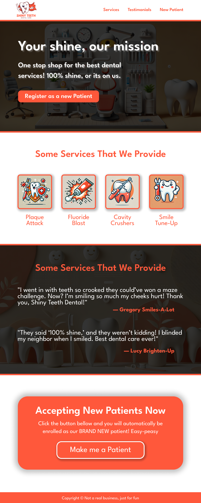

# Landing Page Project

This is a landing page project from TOP in the foundations course.

Link to preview the project requirements [here](https://www.theodinproject.com/lessons/foundations-landing-page)

Shiny Teeth Dental's landing page is just a simple one page website that has a header, a call to action, a few sections about the company, and a footer. The project is to practice using HTML and CSS to create a simple landing page.

Did not put too much effort in trying to design a professional looking website, instead wanted practice with Figma in general and then put the rest of my focus on the HTML and CSS.

## Live preview

Add link here....

## Responsive Design

We are not required to make this project responsive. There is a small chance I will add the responsive design to this project in the future, but for now I will leave it as is. If I add it, I will update below.

## What I did

- Made up a make believe company called Shiny Teeth Dental.
- Generated text and images with ChatGPT and DALL-E.
- Made the Figma design from scratch. (Was good practice, still have a long ways to go to get better at design, but first just getting used to the tool).
- Coded the landing page using HTML and CSS

## Image of the Figma Design file

## Credits

- [The Odin Project](https://www.theodinproject.com/)
- Text within the landing page is generated using [ChatGPT](https://openai.com/chatgpt/)
- Images with ChatGPT generated text from [DALL-E](https://openai.com/dall-e/)

More details coming soon..